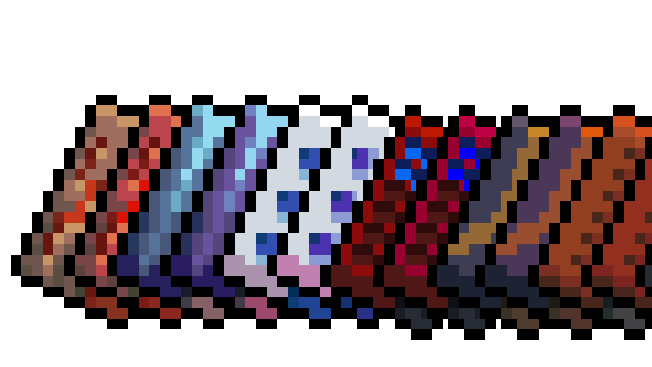

# Quasimorph Company Tech Tiers



## What it does

Quasimorph's generic research datadisks (`low_chip`, `medium_chip`, `high_chip`) unlock items in three
tiers, offered as faction rewards at tech levels 1, 4 and 7. Company chips have no such breakdown:
each of the twelve companies has one monolithic chip, always `TechLevel` 10, offered only at maximum
faction standing — even though the items it unlocks span the whole tech range. `anc_chip`, for
example, unlocks items from tech level 2 to 10, so a company's entry-level pistol is gated behind
maximum standing with that company.

This mod splits each company chip into three tiers, mirroring the generic chips' breakdown, and offers
them as faction rewards earlier:

| Tier | New/existing id | Unlocks | Offered at faction level |
|------|------------------|---------|---------------------------|
| I | `<company>_chip_low` (new) | items tech level 1–3 | 3 |
| II | `<company>_chip_mid` (new) | items tech level 4–6 | 6 |
| III | `<company>_chip` (existing id, unlocks narrowed) | items tech level 7+ | 10 |

Upgrade costs (`ModifyItemsGrades` in `config_crafting`) are remapped so a low-tech item unlocked at
level 3 can also be upgraded at level 3, instead of requiring the level-10 chip.

Everything is derived from the live game config at load time — no item ids, faction names, chip ids or
tech levels are hardcoded. The mod intercepts `config_items`, `config_faction_drops`, `config_crafting`
and `localization` through the game's `ResourcesLoad` mod hook before `ConfigLoader` parses them, and
returns rewritten text; on any unexpected input it logs a warning and falls back to the stock resource,
so a game update that changes the config format disables the mod rather than corrupting anything.

## Configuration

Written to `%LOCALAPPDATA%\..\LocalLow\Magnum Scriptum Ltd\Quasimorph_ModConfigs\QM_CompanyTechTiers\config.json`
on first run.

| Key | Default | Meaning |
|-----|---------|---------|
| `RewardLevels` | `[3, 6, 10]` | Faction tech level at which each tier is offered |
| `TierBoundaries` | `[3, 6]` | Item tech level at which tier 1 ends and tier 2 ends |
| `TierPrices` | `[400, 525, 650]` | `Price` for each tier (index 2 is the parent chip's existing price) |
| `TierTechLevels` | `[1, 4, 10]` | `TechLevel` field written on each tier's datadisk row (index 2 is the parent's existing value) |
| `TierSuffixes` | `[" I", " II", " III"]` | Appended to each tier's display name in every language |
| `WeightDonorIds` | `["low_chip", "medium_chip"]` | Generic chip ids whose drop weight each new tier borrows by default |
| `RemapUpgradeCosts` | `true` | Whether `config_crafting` upgrade costs are rewritten to the matching tier |
| `InheritParentDropWeight` | `false` | If `true`, new tiers use the parent company chip's own drop weight instead of the generic chip's (see below) |
| `DumpConfigsOnLoad` | `false` | Writes the game's raw config text next to this file, for regenerating test fixtures |
| `DumpChipSpritesOnLoad` | `false` | Writes each company chip's icon to `sprite_dump/` next to this file, as editable per-tier PNGs |

**Drop weights.** By default, tier 1 and tier 2 reward-table entries take the drop weight of the
generic chip in the same bracket (`low_chip` / `medium_chip`), not the parent company chip's own
weight. Company chip entries carry weight 115 while a level-3 reward pool totals roughly 40, so
inheriting the parent's weight directly would make company tech about 74% of all chip rewards at
level 3. Set `InheritParentDropWeight` to `true` to restore that behaviour instead.

## Custom tier icons

By default the two new tiers of each company chip (`<company>_chip_low`, `<company>_chip_mid`) share
the parent chip's existing inventory icon, so all three tiers of a company look identical. You can
give the low and mid tiers their own hand-drawn icons; the level-10 chip (`<company>_chip`, the
vanilla item) is never re-skinned and always keeps its base-game appearance.

To draw and install custom icons:

1. Set `DumpChipSpritesOnLoad` to `true` in `config.json` (see the table above) and launch the game
   once. On that launch the mod writes every company chip's icon out twice — once per new tier id —
   as ready-to-edit PNGs to:

   ```
   %LOCALAPPDATA%\..\LocalLow\Magnum Scriptum Ltd\Quasimorph_ModConfigs\QM_CompanyTechTiers\sprite_dump\
   ```

   That is 24 files, e.g. `anc_chip_low.png` and `anc_chip_mid.png` for the `anc` company. Each is
   **19×24 pixels**, RGBA — draw at that exact size; there is no resizing step. Set
   `DumpChipSpritesOnLoad` back to `false` afterward (the dump only needs to run once, and repeating it
   just overwrites the same files with the same unedited icons).

2. Edit the PNGs in `sprite_dump\` with any image editor that preserves the 19×24 size and alpha
   channel.

3. Copy only the files you changed into `media/sprites/` in this repo (create the folder if it isn't
   there yet). The filename is what maps a PNG to a tier id — `anc_chip_low.png` in `media/sprites/`
   replaces the `anc_chip_low` icon and nothing else.

4. Rebuild (`dotnet build -c Release` from `src/`, as in Install below) and relaunch. The build copies
   `media/sprites/*.png` into the deployed mod folder for you.

Only the tier ids whose PNG you copied into `media/sprites/` get a custom icon; every other tier id
keeps rendering with the shared parent chip icon, exactly as before. Check `Player.log` for
`Registered 24 tier descriptors (N with custom art).` — `N` should match the number of PNGs you added.

## Install

Build with `dotnet build -c Release` from `src/`. The build automatically deploys the assembly,
manifest and thumbnail to the local mod-load folder:

```
%LOCALAPPDATA%\..\LocalLow\Magnum Scriptum Ltd\Quasimorph\LocalUserPresets\QM_CompanyTechTiers\
```

Quasimorph 1.0.1+ never calls `UserModSystem.LoadModifications`, so there is no plain `Mods` folder —
`LocalUserPresets` is the only local (non-Workshop) load path, and it works because `LoadCustomPresets`
routes through the same loader as Workshop mods. Pass `-p:LocalDeploy=false` to skip this step.

## Known risks

- **Save compatibility.** Saves created with the mod contain the new item ids (`<company>_chip_low`,
  `<company>_chip_mid`). Removing the mod later leaves unknown ids in the save. Unlocks already granted
  stay granted; the mod does not migrate existing saves.
- **Conflicts with other config-rewriting mods.** Any other mod that rewrites `config_items`,
  `config_faction_drops` or `config_crafting` wholesale (rather than patching parsed data) can conflict
  with this one, since both mods compete over the same raw config text. Mods that patch parsed data
  after load are unaffected.

## Source

Source code is available on GitHub at https://github.com/babyak/QM_CompanyTechTiers
